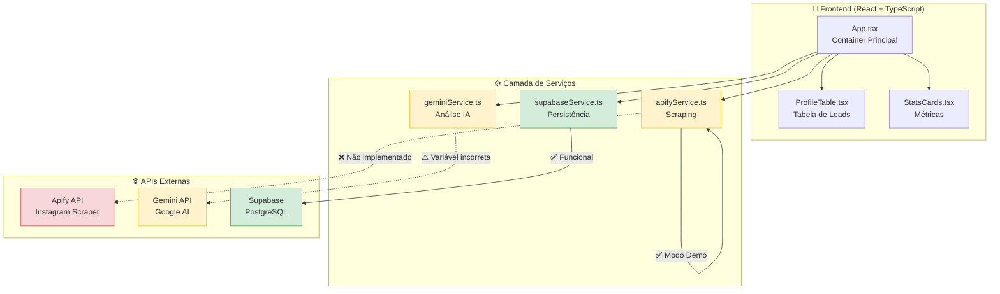

# Contexto do Projeto: InstaAnalyzer Pro

## Visão Geral
**InstaAnalyzer Pro** é uma aplicação React moderna para qualificação e análise de leads do Instagram. O sistema permite upload de listas (CSV), simula/realiza scraping de dados, enriquece informações via IA (Gemini) e sincroniza os resultados com um banco de dados Supabase.

**Status Atual:** Protótipo funcional com scraping simulado e integração ativa com Gemini AI e Supabase.

## 🛠 Stack Tecnológica Atual
*   **Frontend:** React 19 (Vite 6) + TypeScript
*   **Estilização:** Tailwind CSS (via classes utilitárias) + Lucide React (Ícones)
*   **IA / Enriquecimento:** Google Gemini SDK (`@google/genai`) - Modelo `gemini-3-flash-preview`
*   **Banco de Dados:** Supabase (`@supabase/supabase-js`)
*   **Scraping:** Service Layer preparado para Apify (Atualmente usando **Mock/Simulação**)

## 📂 Estrutura de Arquivos
*   `App.tsx` - Controlador principal (Dashboard, Upload, Gestão de Estado).
*   `components/`
    *   `StatsCards.tsx` - Cards de estatísticas (Total, Verificados, Ativos, etc).
    *   `ProfileTable.tsx` - Tabela detalhada dos leads.
*   `services/`
    *   `apifyService.ts` - **[ATENÇÃO]** Lógica de scraping. Atualmente contém apenas dados simulados (`simulateScraping`). Precisa ser ativada para produção.
    *   `geminiService.ts` - Classificação de nicho via IA.
    *   `supabaseService.ts` - Sincronização (Upsert/Select) com tabela `insta_leads`.
*   `types.ts` - Definições de interfaces (`InstagramProfile`, `ScrapingStats`).

## 🚀 Funcionalidades
1.  **Importação:** Upload de arquivos `.csv` ou `.txt` com links de perfis.
2.  **Análise (Simulada):** Gera dados fictícios (bio, seguidores, verificado) para testes de UI.
3.  **Classificação via IA:** Tenta classificar o nicho do perfil usando Gemini (requer API Key).
4.  **Sincronização Cloud:** Salva/Carrega dados automaticamente do Supabase.
5.  **Exportação:** Suporte nativo para download em CSV, JSON e Markdown.

## ⚠️ Pontos de Atenção (To-Do)
*   **Scraping Real:** O arquivo `services/apifyService.ts` precisa ser atualizado para chamar a API do Apify de verdade quando o modo "Produção" estiver ativo. Atualmente ele sempre chama o mock.
*   **Segurança:** Chaves de API (Supabase/Gemini) devem ser verificadas e movidas para variáveis de ambiente (`.env`) se ainda não estiverem.
*   **Banco de Dados:** A tabela `insta_leads` no Supabase deve ter as colunas corretas (`full_name`, `bio`, `niche`, etc.) para evitar erros de inserção.

## 📝 Comandos
*   `npm install` - Instalar dependências.
*   `npm run dev` - Rodar servidor local.
*   `npm run build` - Build para produção.

---

## 🏗 Diagrama de Arquitetura



**Legenda:**
- 🟢 Verde: Funcional
- 🟡 Amarelo: Parcialmente funcional / Requer atenção
- 🔴 Vermelho: Não implementado

---

## 🐛 Problemas Conhecidos

### 1. Gemini Service - Variável de Ambiente Incorreta
**Arquivo:** `services/geminiService.ts` (linha 4)

**Problema:**
```typescript
const ai = new GoogleGenAI({ apiKey: process.env.API_KEY || '' });
```

**Solução:**
```typescript
const ai = new GoogleGenAI({ 
  apiKey: import.meta.env.VITE_GEMINI_API_KEY || '' 
});
```

**Impacto:** Análise de nicho via IA não funciona.

---

### 2. Apify Service - Sempre Retorna Mock
**Arquivo:** `services/apifyService.ts` (linhas 9-12)

**Problema:**
```typescript
if (!apifyToken || apifyToken === 'DEMO') {
  return simulateScraping(urls, onProgress);
}
return simulateScraping(urls, onProgress); // ← Sempre mock
```

**Solução:** Implementar chamada real à API do Apify quando token for válido.

**Impacto:** Não coleta dados reais do Instagram.

---

### 3. Credenciais Hardcoded
**Arquivo:** `services/supabaseService.ts` (linhas 5-6)

**Problema:**
```typescript
const SUPABASE_URL = 'https://sua-url.supabase.co';
const SUPABASE_KEY = 'sua-chave-aqui';
```

**Solução:** Mover para `.env.local`:
```env
VITE_SUPABASE_URL=https://sua-url.supabase.co
VITE_SUPABASE_KEY=sua-chave-aqui
```

**Impacto:** Risco de segurança (baixo, pois é chave pública).

---

## 📚 Documentação Adicional

Para informações mais detalhadas, consulte:
- **[README.md](./README.md)** - Guia de início rápido
- **[DOCUMENTATION.md](./DOCUMENTATION.md)** - Documentação técnica completa
- **[PROJECT_STATUS.md](./PROJECT_STATUS.md)** - Status atual e próximos passos
- **[PLANNING.md](./PLANNING.md)** - Roadmap do projeto
